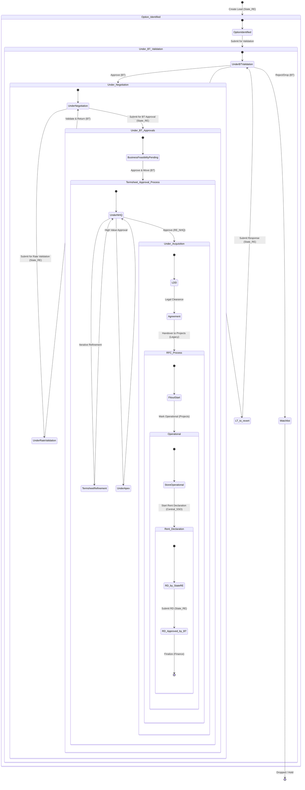

# REAgent / LeadManager - Pan-India Real Estate Workflow

## Product Overview
REAgent (LeadManager) is a role-based lead management system designed to streamline the "Pan-India New Store Opening" workflow, facilitating a 10-stage process from "Option Identified" to "Rent Declaration".

---

## 5. Workflow State Diagram & Role-Based Action Control

Below is the visual representation of the Lead Lifecycle, illustrating the flow between stages, sub-statuses, and the responsible roles.

---

## 6. Action Control, Inputs & Gap Analysis (Done vs. To-Be-Done)

The following matrix details the permissions, required inputs, and current implementation status for each workflow stage.

### Stage 1: Option Identified
| Role | Action | Input Parameters | Attributes to Add (Future) | Done ✅ | Yet to be Done 🚧 |
| :--- | :--- | :--- | :--- | :--- | :--- |
| **State_RE** | Create Lead | `title`, `details` (basic text) | `location_coordinates`, `photos` (mandatory), `carpet_area` | Basic CRUD, Role Check | Field Validation, Google Maps Integration, File Uploads |

### Stage 2: Under BT Validation
| Role | Action | Input Parameters | Attributes to Add (Future) | Done ✅ | Yet to be Done 🚧 |
| :--- | :--- | :--- | :--- | :--- | :--- |
| **BT** | Approve | `remarks` | `sales_projection_v1`, `catchment_score` | Status Transition | AI-based Sales Prediction, Auto-assignment to specific BT User |
| **BT** | Raise Query | `query_text`, `remarks` | `query_category` (e.g., Competition, Demographics) | Ping-pong logic (Status Change) | Threaded Comments UI for query resolution |
| **State_RE** | Reply to Query | `response_text` | `supporting_docs` | Transition back to BT | Notification to BT upon reply |

### Stage 3: Under Negotiation
| Role | Action | Input Parameters | Attributes to Add (Future) | Done ✅ | Yet to be Done 🚧 |
| :--- | :--- | :--- | :--- | :--- | :--- |
| **State_RE** | Submit Rate | `negotiated_rent`, `capex_ask` | `rent_comparison_matrix`, `competitor_rents` | Transition logic | "Rate Audit" feature comparing vs market average |
| **BT** | Validate Rate | `validation_status` | `max_approvable_limit` | Reversion logic | Logic to auto-reject if > budget limit |

### Stage 4: Under BT Approvals
| Role | Action | Input Parameters | Attributes to Add (Future) | Done ✅ | Yet to be Done 🚧 |
| :--- | :--- | :--- | :--- | :--- | :--- |
| **BT** | Finalize Feasibility | `final_sales_projection`, `margin_analysis` | `layout_plan` (file), `npv_calculation` | Transition to Termsheet | Layout Version Control, Approval Workflow Engine integration |

### Stage 5: Termsheet Approval
| Role | Action | Input Parameters | Attributes to Add (Future) | Done ✅ | Yet to be Done 🚧 |
| :--- | :--- | :--- | :--- | :--- | :--- |
| **RE_NHQ** | Validate Termsheet | `commercial_terms` | `standard_clause_deviation_flag` | Role-gating | Digital Signature integration (DocuSign) |
| **Apex** | High Value Approval | `approval_status` | `board_resolution_ref` | Manual status update support | Conditional Logic (System auto-routes to Apex if Rent > X) |

### Stage 6: Under Acquisition (Legal)
| Role | Action | Input Parameters | Attributes to Add (Future) | Done ✅ | Yet to be Done 🚧 |
| :--- | :--- | :--- | :--- | :--- | :--- |
| **Legal** | Clear Title | `ldd_report`, `title_status` | `lawyer_assigned`, `risk_level` | Basic Status Tracking | Document Management System (DMS) integration |
| **Legal** | Register Lease | `registration_date`, `doc_number` | `scanned_deed` | status update | OCR extraction of key dates from uploaded deed |

### Stage 7: RFC / Fitout (Projects)
| Role | Action | Input Parameters | Attributes to Add (Future) | Done ✅ | Yet to be Done 🚧 |
| :--- | :--- | :--- | :--- | :--- | :--- |
| **Projects** | Mark Operational | `store_handover_date` | `snag_list`, `final_measurement_certificate` | Status: Operational | Integration with Project Management Tool (Jira/Asana) |

### Stage 8: Operational (Central SSO)
| Role | Action | Input Parameters | Attributes to Add (Future) | Done ✅ | Yet to be Done 🚧 |
| :--- | :--- | :--- | :--- | :--- | :--- |
| **Central_SSO**| Initiate Rent Decl. | `go_live_date` | `sap_store_code` | Transition to Rent Decl. | Auto-push to SAP/ERP system |

### Stage 9: Rent Declaration (Finance)
| Role | Action | Input Parameters | Attributes to Add (Future) | Done ✅ | Yet to be Done 🚧 |
| :--- | :--- | :--- | :--- | :--- | :--- |
| **Finance** | Activate Payment | `sap_vendor_code`, `payment_start_date`| `bank_mandate_copy` | Final Workflow Step | Automated email to Landlord with payment schedule |

---

## 7. Future Roadmap: Missing Features & Access Controls

### 1. Granular Attribute Access Control
*   **Current State**: Roles control *transitions* (e.g., Next Step).
*   **To-Be Implemented**: Roles should control *field-level* visibility.
    *   *Example*: Only **Finance** should see `bank_details`.
    *   *Example*: Only **BT** and **Apex** should see confidential `margin_analysis`.

### 2. Notifications & SLAs
*   **Current State**: Passive dashboard viewing.
*   **To-Be Implemented**:
    *   **Email/Slack Alerts**: When a lead enters your queue for action.
    *   **SLA Tracking**: "Red Flag" if a lead sits in `Under_Negotiation` for > 7 days.

### 3. File Handling
*   **Current State**: Input fields are text-only.
*   **To-Be Implemented**:
    *   S3/Blob storage for Photos, Layouts, Legal Docs.
    *   Previewers for PDF/Images within `LeadDetail`.

### 4. Dynamic "Ping-Pong" Logic
*   **Current State**: Some hardcoded "Return to BT" logic exists in `LeadDetail.jsx`.
*   **To-Be Implemented**: A generic "Reject to Previous Stage" function in the backend that auto-calculates the reverse path without hardcoding.
